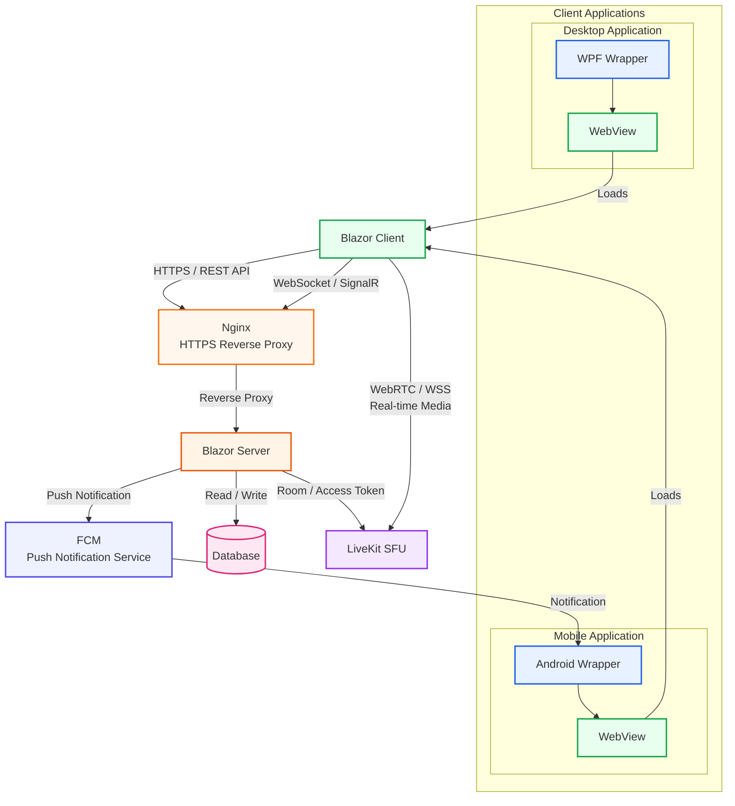
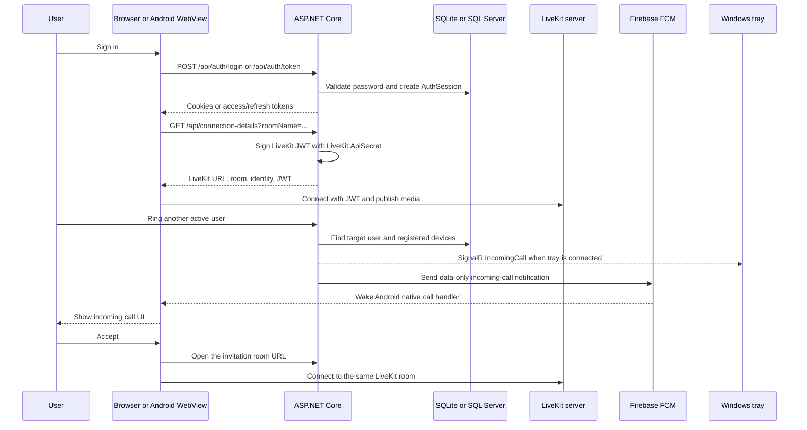

# LiveKit Meet

LiveKit Meet is a self-hosted video-meeting application built around an ASP.NET Core and Blazor server. The repository also contains an Android application, a Windows tray client, a legacy WebView2 wrapper, and an optional Caddy reverse proxy for LAN HTTPS.

The web server owns authentication, users, call invitations, Firebase push delivery, LiveKit access-token generation, and the database. LiveKit remains a separate media server. Firebase Cloud Messaging remains a separate push transport.

## Contents

- [Architecture](#architecture)
- [Repository layout](#repository-layout)
- [Prerequisites](#prerequisites)
- [Configuration](#configuration)
- [Firebase credentials](#firebase-credentials)
- [Run the complete local stack](#run-the-complete-local-stack)
- [Build all deliverables](#build-all-deliverables)
- [Android APK with EAS](#android-apk-with-eas)
- [Operational flows](#operational-flows)
- [Troubleshooting](#troubleshooting)
- [Security checklist](#security-checklist)

## Architecture



The direct-development topology can omit Caddy. In that case, clients use the ASP.NET URL directly and the LiveKit URL must be reachable directly. The supplied Caddy configuration is the intended LAN topology when Android needs a single HTTPS origin and a WebSocket route for LiveKit.

### Call and room flow



## Repository layout

| Path | Purpose |
| --- | --- |
| `livekitmeet/` | ASP.NET Core .NET 8 web server, Blazor UI, minimal APIs, SignalR, EF Core data layer, and LiveKit/Firebase services. |
| `livekitmeet/Components/Pages/` | Blazor pages: home, login, room, profile, and administrator user management. |
| `livekitmeet/wwwroot/js/livekit-bridge.js` | Browser-side bridge that loads the LiveKit JavaScript SDK, joins rooms, publishes media, and updates the UI. |
| `livekitmeet/Data/` | `AppDbContext`, user/session entities, push-device entity, and startup database initialization. |
| `livekitmeet/Services/` | Authentication, LiveKit JWT generation, invitation delivery, Firebase FCM, and user administration. |
| `LiveKitMeet.Mobile/` | Expo SDK 54 React Native Android wrapper with WebView, FCM registration, incoming-call native module, and runtime server selection. |
| `LiveKitMeet.Mobile/plugins/withIncomingCall.js` | Expo config plugin that adds the Android Firebase messaging service and full-screen incoming-call activity. |
| `LiveKitMeet.Mobile/plugins/withUserCaTrust.js` | Expo config plugin that permits user-installed CAs for local Caddy certificates. |
| `LiveKitMeet.Tray/` | .NET 8 Windows Forms tray client. It listens to the authenticated SignalR invitation hub and opens accepted rooms in the default browser. |
| `webview-wrapper/meetwrapper/` | Separate legacy .NET Framework 4.7.2 WebView2 application. It is not part of `livekitmeet.sln`. |
| `infra/local/Caddyfile` | Optional LAN HTTPS reverse proxy. It sends application traffic to `127.0.0.1:5189` and `/livekit` traffic to `127.0.0.1:7880`. |
| `livekitmeet.sln` | Modern .NET solution containing the web server and tray client. |

### Runtime responsibilities

#### ASP.NET Core web server

- Uses Blazor Interactive Server for the web UI.
- Uses JWT access and rotating refresh tokens for browser, Android, and tray authentication.
- Accepts browser cookies, `Authorization: Bearer`, and SignalR query-string access tokens.
- Initializes the database with `EnsureCreatedAsync` and creates the configured initial administrator on first startup.
- Uses SQLite by default and supports SQL Server through the `Database:Provider` setting.
- Exposes minimal API endpoints for login, refresh, logout, password changes, push-device registration, and LiveKit connection details.
- Exposes the authenticated `/hubs/call-invitations` SignalR hub.
- Sends an invitation over SignalR when a tray is connected and sends FCM notifications to registered Android devices.

#### Android application

The Android client is a native Expo build around the existing website. It keeps the web login and room session inside a WebView, registers the native FCM token at `/api/devices/fcm`, requests camera and microphone permissions, and opens invitation room URLs when a call is accepted. The full-screen incoming-call service is added by the custom Expo plugin, so Expo Go is not equivalent to the production APK for incoming-call testing.

#### Windows tray client

The tray client signs in through `/api/auth/token`, stores only the rotating refresh token protected with Windows DPAPI for the current Windows user, and maintains an authenticated SignalR connection to `/hubs/call-invitations`. It must remain connected for a web Ring action to reach that user through the tray.

#### LiveKit server

The repository does not contain the LiveKit SFU binary, Docker Compose file, or a LiveKit server configuration. Start LiveKit separately and configure the ASP.NET server with the matching API key, API secret, and client URL. The default Caddy route expects LiveKit to listen on `127.0.0.1:7880`.

## Prerequisites

Install the tools needed for the deliverable you are building:

- Windows 10/11.
- .NET 8 SDK. The web and tray projects target .NET 8.
- Visual Studio 2022 or the .NET CLI. The tray project requires Windows Forms support.
- Node.js and npm compatible with the Expo SDK in `LiveKitMeet.Mobile/package.json`.
- Android Studio, Android SDK, platform tools, an emulator or USB-debuggable Android device, and a compatible JDK for local Android builds.
- An Expo account and the EAS CLI for cloud APK/AAB builds.
- A separately installed LiveKit server.
- Caddy only if using the supplied LAN HTTPS topology.
- Visual Studio .NET Framework 4.7.2 development tools and the Microsoft WebView2 Runtime for the legacy wrapper.

Check the main local tools:

```powershell
dotnet --version
node --version
npm --version
adb version
```

## Configuration

Run the following commands from the repository root, the directory containing `livekitmeet.sln`.

### ASP.NET Core settings

`livekitmeet/appsettings.json` contains development defaults. Override secrets and machine-specific values with .NET User Secrets or environment variables. The project already has the User Secrets ID `livekitmeet-development`, so no `dotnet user-secrets init` command is required.

Important configuration keys:

| Key | Required value |
| --- | --- |
| `Database:Provider` | `Sqlite` or `SqlServer`. Defaults to `Sqlite`. |
| `Database:ConnectionString` | SQLite file path or SQL Server connection string. |
| `Auth:JwtSecret` | At least 32 bytes. Use a unique random value outside source control. |
| `Auth:AccessTokenMinutes` | Access-token lifetime. |
| `Auth:RefreshTokenDays` | Refresh-token lifetime. |
| `Admin:UserName` | Initial administrator username. |
| `Admin:DisplayName` | Initial administrator display name. |
| `Admin:Password` | Initial administrator password. Change the development default. |
| `LiveKit:ApiKey` | LiveKit API key used to sign room tokens. |
| `LiveKit:ApiSecret` | Matching LiveKit API secret. |
| `LiveKit:Url` | Client-reachable `ws://` or `wss://` URL, for example `wss://meet.example.com/livekit`. |
| `Firebase:ServiceAccountPath` | Path to the server-only Firebase Admin SDK JSON file, or use the individual Firebase fields below. |

Example development secrets:

```powershell
dotnet user-secrets --project .\livekitmeet\livekitmeet.csproj set "Auth:JwtSecret" "replace-with-a-random-secret-at-least-32-bytes"
dotnet user-secrets --project .\livekitmeet\livekitmeet.csproj set "Admin:UserName" "admin"
dotnet user-secrets --project .\livekitmeet\livekitmeet.csproj set "Admin:DisplayName" "Administrator"
dotnet user-secrets --project .\livekitmeet\livekitmeet.csproj set "Admin:Password" "replace-with-a-development-password"
dotnet user-secrets --project .\livekitmeet\livekitmeet.csproj set "LiveKit:ApiKey" "devkey"
dotnet user-secrets --project .\livekitmeet\livekitmeet.csproj set "LiveKit:ApiSecret" "replace-with-the-livekit-secret"
dotnet user-secrets --project .\livekitmeet\livekitmeet.csproj set "LiveKit:Url" "wss://192.168.1.6:8443/livekit"
```

For a local SQL Server instance:

```powershell
dotnet user-secrets --project .\livekitmeet\livekitmeet.csproj set "Database:Provider" "SqlServer"
dotnet user-secrets --project .\livekitmeet\livekitmeet.csproj set "Database:ConnectionString" "Server=localhost;Database=LiveKitMeet;Trusted_Connection=True;TrustServerCertificate=True;"
```

For a local-only configuration file, copy `livekitmeet/appsettings.Development.json.example` to `livekitmeet/appsettings.Development.json` and replace the placeholder values. This file is ignored by Git. User Secrets is preferred because private values remain outside the project directory.

To inspect which keys exist, without putting the output in source control:

```powershell
dotnet user-secrets --project .\livekitmeet\livekitmeet.csproj list
```

Do not paste the output of that command into an issue or commit it.

### LiveKit URL and Caddy routing

The supplied `infra/local/Caddyfile` currently uses `192.168.1.6` and listens on `8443`:

```text
https://192.168.1.6:8443 {
    /           -> ASP.NET Core at 127.0.0.1:5189
    /livekit/*  -> LiveKit at 127.0.0.1:7880
}
```

Before using another machine or LAN address:

1. Replace the host in `infra/local/Caddyfile` with the address clients can reach.
2. Set `LiveKit:Url` to `wss://<host>:8443/livekit`.
3. Set the Android server URL to `https://<host>:8443`.
4. Make the Caddy local root CA trusted by the development phone or emulator. The Android `withUserCaTrust` plugin permits user-installed CAs; it does not make an unknown certificate trusted automatically.
5. Allow ports `8443` and, when clients bypass Caddy, `5189` or `7880` through the Windows firewall as appropriate.

For the first server smoke test, use direct HTTP and skip Caddy:

```powershell
dotnet run --project .\livekitmeet\livekitmeet.csproj --urls http://0.0.0.0:5189
```

The Android emulator reaches the host machine through `http://10.0.2.2:5189`. A physical device must use the host computer's LAN IP, for example `http://192.168.1.10:5189`. Use HTTPS for anything beyond local development.

### Database behavior

The application creates the database automatically at startup. With the default SQLite configuration, the database file is `livekitmeet.db` under the application's working/content directory. The initializer also creates the `PushDevices` table and its indexes when needed.

There are no EF Core migration files in this repository. `EnsureCreatedAsync` is convenient for development but is not a production schema migration strategy. Back up the database before changing schemas or resetting local data.

## Firebase credentials

There are two different Firebase JSON files. They must not be interchanged:

| File | Used by | Where it belongs |
| --- | --- | --- |
| Firebase Admin SDK service-account JSON, usually named `firebase-service-account.json` | ASP.NET Core FCM sender | Outside the repository; never in the Android APK or EAS project files. |
| Android `google-services.json` | Firebase SDK configuration embedded in the Android build | `LiveKitMeet.Mobile/google-services.json` for local builds, or an EAS file environment variable for cloud builds. |

### Configure the server with the Admin SDK JSON

1. In Firebase Console, select the project used by the Android app.
2. Open **Project settings**, **Service accounts**, and create a private key.
3. Store the downloaded JSON outside the repository, for example `C:\secure\firebase-service-account.json`.
4. Set the file path as a .NET User Secret:

```powershell
$firebaseJsonPath = "C:\secure\firebase-service-account.json"
dotnet user-secrets --project .\livekitmeet\livekitmeet.csproj set "Firebase:ServiceAccountPath" $firebaseJsonPath
```

The server reads `project_id`, `client_email`, and `private_key` from that file at runtime. This is the recommended local Visual Studio/F5 setup.

If the service-account file cannot be mounted in the process environment, store the complete JSON in the supported `Firebase:PrivateKey` secret instead. The application recognizes JSON in this setting and extracts the three required fields:

```powershell
$firebaseJson = Get-Content $firebaseJsonPath -Raw
dotnet user-secrets --project .\livekitmeet\livekitmeet.csproj set "Firebase:PrivateKey" $firebaseJson
```

Alternatively, store the fields separately:

```powershell
$firebaseAccount = Get-Content $firebaseJsonPath -Raw | ConvertFrom-Json
dotnet user-secrets --project .\livekitmeet\livekitmeet.csproj set "Firebase:ProjectId" $firebaseAccount.project_id
dotnet user-secrets --project .\livekitmeet\livekitmeet.csproj set "Firebase:ClientEmail" $firebaseAccount.client_email
dotnet user-secrets --project .\livekitmeet\livekitmeet.csproj set "Firebase:PrivateKey" $firebaseAccount.private_key
```

Use one approach consistently. If `Firebase:ServiceAccountPath` is set, the JSON file is the source of truth. The server also accepts a file path accidentally placed in `Firebase:PrivateKey` for compatibility.

For a terminal-only run, the equivalent environment variables use double underscores:

```powershell
$env:Firebase__ServiceAccountPath = "C:\secure\firebase-service-account.json"
dotnet run --project .\livekitmeet\livekitmeet.csproj --urls http://0.0.0.0:5189
```

Never upload this Admin SDK JSON to EAS. It grants server-side access and is not an Android application configuration file.

### Configure Android Firebase

1. In Firebase Console, add an Android app with package name `com.livekitmeet.mobile`.
2. Download that Android app's `google-services.json`.
3. Put it at `LiveKitMeet.Mobile/google-services.json` for local native builds. The mobile `.gitignore` excludes it.
4. Confirm the Firebase project and package name match the app configuration in `LiveKitMeet.Mobile/app.json`.

## Run the complete local stack

The following sequence brings up the server, optional HTTPS edge, browser, tray, and Android client.

### 1. Restore and build the modern .NET solution

```powershell
dotnet restore .\livekitmeet.sln
dotnet build .\livekitmeet.sln -c Debug
```

### 2. Start LiveKit separately

Start the LiveKit server using your self-hosted or managed deployment. For the supplied Caddy setup it must be reachable at `127.0.0.1:7880`, and its API credentials must match `LiveKit:ApiKey` and `LiveKit:ApiSecret` in the ASP.NET configuration.

The important contract is:

- The ASP.NET process signs room tokens.
- The client receives `LiveKit:Url` from `/api/connection-details`.
- The client connects to LiveKit directly or through the Caddy `/livekit` WebSocket route.
- The LiveKit API key and secret are never sent to clients.

### 3. Start ASP.NET Core

For direct HTTP development:

```powershell
dotnet run --project .\livekitmeet\livekitmeet.csproj --launch-profile http
```

Open `http://localhost:5189`. The first startup creates the database and the initial admin user from the `Admin:*` settings.

For the HTTPS launch profile:

```powershell
dotnet run --project .\livekitmeet\livekitmeet.csproj --launch-profile https
```

The configured development URLs are `https://localhost:7230` and `http://localhost:5189`. A browser or device may require trust configuration for the development certificate.

### 4. Optional: start Caddy for LAN HTTPS

Use this when the phone must reach the app over HTTPS or when the browser and LiveKit signaling should share one origin:

```powershell
caddy run --config .\infra\local\Caddyfile
```

With the checked-in host value, the public application URL is `https://192.168.1.6:8443`. Update the Caddyfile, `LiveKit:Url`, and mobile server URL together when the host changes.

### 5. Verify the browser client

1. Open the application URL.
2. Sign in with the initial administrator.
3. Use the administrator page to create active users.
4. Sign in as two different users in separate browser sessions.
5. Open a room, allow camera and microphone access, and confirm the LiveKit connection.
6. Use the Ring action with the other user's exact username.

### 6. Run the Windows tray client

Keep the server running, then start the tray process from the repository root:

```powershell
dotnet run --project .\LiveKitMeet.Tray\LiveKitMeet.Tray.csproj
```

Sign in with an active web user. The tray stores its refresh token under the current Windows user's DPAPI-protected application settings. Leave the tray connected while testing Ring. Accepting a call opens the server-provided room URL in the default browser.

### 7. Run the Android client locally

Install JavaScript dependencies and ensure `LiveKitMeet.Mobile/google-services.json` exists:

```powershell
Set-Location .\LiveKitMeet.Mobile
npm ci
```

For an Android emulator, use `http://10.0.2.2:5189` as the server URL. For a physical device, use a reachable LAN address or the Caddy HTTPS URL. The mobile wrapper creates an app-private `config.json` on first launch; use `LiveKitMeet.Mobile/config.json.example` as the template and edit the installed app's file before restarting it when the server changes.

Build and install the native development APK:

```powershell
npx expo run:android
```

This command needs Android Studio/SDK, an emulator or connected device, and a development server that the device can reach. Expo Go is useful for basic WebView work but cannot reproduce all of the custom incoming-call native behavior.

After the app starts:

1. Grant camera, microphone, notifications, and other requested permissions.
2. Sign in as an active web user.
3. Confirm the app posts its Android FCM token to `/api/devices/fcm`.
4. Ring that user from another signed-in client.
5. Accept the incoming call and verify that the invitation room opens inside the WebView.

## Build all deliverables

### Modern .NET solution

Build both the web server and tray client:

```powershell
dotnet build .\livekitmeet.sln -c Release
```

Publish the deployable directories:

```powershell
dotnet publish .\livekitmeet\livekitmeet.csproj -c Release -o .\artifacts\web
dotnet publish .\LiveKitMeet.Tray\LiveKitMeet.Tray.csproj -c Release -r win-x64 --self-contained false -o .\artifacts\tray
```

The web publish output still needs its runtime configuration, database, LiveKit credentials, Firebase credentials, and a separately running LiveKit service.

### Android local build

```powershell
Set-Location .\LiveKitMeet.Mobile
npm ci
npx expo prebuild --platform android --clean
Set-Location .\android
.\gradlew.bat assembleRelease
```

The release APK is written to `android/app/build/outputs/apk/release/app-release.apk`.

The generated native Android project is ignored by the mobile Git rules. The custom Expo plugins regenerate their Android changes during prebuild/build.

### Legacy WebView2 wrapper

This application has its own solution and targets .NET Framework 4.7.2. It is separate from `livekitmeet.sln`.

1. Install the .NET Framework 4.7.2 developer targeting pack and Microsoft WebView2 Runtime.
2. Restore the packages referenced by `webview-wrapper/meetwrapper/meetwrapper/packages.config`.
3. Update the `HomeUrl` constant in `webview-wrapper/meetwrapper/meetwrapper/Form1.cs` if the server address has changed. The current value is a development URL and is not read from ASP.NET configuration.
4. Open `webview-wrapper/meetwrapper/meetwrapper.sln` in Visual Studio and build `Release`, or run MSBuild:

```powershell
nuget restore .\webview-wrapper\meetwrapper\meetwrapper.sln
msbuild .\webview-wrapper\meetwrapper\meetwrapper.sln /p:Configuration=Release
```

The wrapper is a browser shell. It does not host the ASP.NET server, generate tokens, or replace the tray client.

## Android APK with EAS

The EAS profiles are defined in `LiveKitMeet.Mobile/eas.json`:

| Profile | EAS environment | Artifact | Intended use |
| --- | --- | --- | --- |
| `preview` | `preview` | Installable Android APK | Internal testing and sideloading. |
| `production` | `production` | Android App Bundle (`.aab`) | Play Store release. |

The `LiveKitMeet.Mobile/app.config.js` file resolves the Android Firebase file as follows:

```text
GOOGLE_SERVICES_JSON from the EAS environment, otherwise ./google-services.json locally
```

### Upload `google-services.json` to EAS as a file secret

Do not upload `firebase-service-account.json`. Upload only the Android client file `google-services.json`.

#### EAS dashboard method

1. Change to `LiveKitMeet.Mobile` and log in to the Expo account that owns the project in `app.json`.
2. Open the project's **Project settings** on `expo.dev`.
3. Open **Environment variables** and choose **Add variable**.
4. Set the name to `GOOGLE_SERVICES_JSON`.
5. Choose the **file** value type and upload the local `google-services.json`.
6. Set scope to **Project**.
7. Set visibility to **Secret**.
8. Assign it to the `preview` environment. Repeat for `production` if production builds are required.

The variable must be present in every EAS environment used by a build profile. A preview variable is not automatically available to a production build.

#### EAS CLI method

Run these commands from `LiveKitMeet.Mobile`:

```powershell
npx eas-cli@latest login
npx eas-cli@latest project:info
npx eas-cli@latest env:set --name GOOGLE_SERVICES_JSON --value .\google-services.json --type file --environment preview --visibility secret --scope project
npx eas-cli@latest env:set --name GOOGLE_SERVICES_JSON --value .\google-services.json --type file --environment production --visibility secret --scope project
npx eas-cli@latest env:list --environment preview --scope project
```

The list command should show the variable name. Do not request or print file contents with `--include-file-content` in a shared terminal or CI log.

### Configure the server URL used by the APK

The Android app must reach the deployed ASP.NET URL. For a real preview or production build, set a public HTTPS URL, not `localhost`, `10.0.2.2`, or an unreachable LAN address:

```powershell
npx eas-cli@latest env:set --name EXPO_PUBLIC_SERVER_URL --value https://meet.example.com --environment preview --visibility plaintext --scope project
npx eas-cli@latest env:set --name EXPO_PUBLIC_SERVER_URL --value https://meet.example.com --environment production --visibility plaintext --scope project
```

`EXPO_PUBLIC_SERVER_URL` is intentionally public application configuration. It is embedded in the client and must not contain credentials. If it is not set, the app falls back to `expo.extra.serverUrl` in `app.json`, currently `https://192.168.1.6:8443`.

### Build the APK

The `preview` profile is configured with `android.buildType: apk`:

```powershell
Set-Location .\LiveKitMeet.Mobile
npx eas-cli@latest build --platform android --profile preview
```

The existing npm shortcut is also available when the `eas` command is installed:

```powershell
npm run build:apk
```

Download the finished APK from the EAS build page or CLI output and install it on a test device. The device must be able to reach the configured server URL, and the server must be able to reach Firebase and LiveKit.

For a Play Store bundle:

```powershell
npx eas-cli@latest build --platform android --profile production
```

The production profile produces an `.aab`, not an APK. EAS manages Android signing credentials when prompted. Firebase `google-services.json` configures the app's Firebase project; it is not the Android signing key.

### EAS build checklist

- `GOOGLE_SERVICES_JSON` is a **file** variable, not a string containing a path.
- The variable exists in the exact environment selected by the profile.
- The Android package is `com.livekitmeet.mobile` in Firebase and `app.json`.
- `firebase-service-account.json` is not in the EAS archive or mobile source tree.
- `EXPO_PUBLIC_SERVER_URL` points to an HTTPS server reachable from the test device.
- `LiveKit:Url` returned by the server is reachable from that same device.
- Android notification, camera, and microphone permissions are granted.

## Operational flows

### Authentication

| Route | Purpose | Client |
| --- | --- | --- |
| `POST /api/auth/login` | Form login and browser auth-cookie redirect. | Browser/Blazor. |
| `POST /api/auth/token` | JSON login returning access and refresh tokens. | Tray and native/mobile integrations. |
| `POST /api/auth/refresh` | Refresh browser cookies. | Browser. |
| `POST /api/auth/token/refresh` | Rotate a JSON refresh token. | Tray and token clients. |
| `POST /api/auth/logout` | Revoke the current browser session. | Browser. |
| `POST /api/auth/change-password` | Change the signed-in user's password. | Browser. |

### Rooms and LiveKit

1. The Room page asks the server for `/api/connection-details` with a room name.
2. `LiveKitTokenService` signs a short-lived LiveKit JWT using the server-only API secret.
3. The server returns the configured LiveKit URL, room name, participant identity, display name, metadata, and token.
4. `livekit-bridge.js` calls the LiveKit JavaScript SDK and manages tracks, participants, audio, camera, and cleanup.

### Invitations and push notifications

1. The caller selects an active target username in the Room page.
2. `CallInvitationService` creates a short-lived invitation and looks up the target's registered devices.
3. A connected tray receives `IncomingCall` through its per-user SignalR group.
4. Registered Android tokens receive an FCM data message.
5. The Android native Firebase service displays the full-screen incoming-call activity. The React Native layer handles accept/decline and opens the invitation URL in the WebView.
6. If the target has neither a connected tray nor a deliverable Android device, the caller receives an error explaining the missing delivery path.

The device routes are:

- `POST /api/devices/fcm` registers or refreshes an Android FCM token for the authenticated user.
- `POST /api/devices/fcm/unregister` marks the token inactive.
- `GET /api/connection-details` creates LiveKit connection details for an authenticated user.
- `GET/POST /hubs/call-invitations` is the authenticated SignalR transport used by the tray and invitation UI.

## Troubleshooting

### The server exits during startup

- Check that `Auth:JwtSecret` is at least 32 bytes.
- Check that `Admin:UserName` and `Admin:Password` are non-empty.
- Check that `Database:Provider` is exactly `Sqlite` or `SqlServer`.
- Check that the SQL Server connection string is reachable when using SQL Server.

### Login works but rooms do not connect

- Confirm `LiveKit:ApiKey` and `LiveKit:ApiSecret` match the LiveKit server.
- Confirm `LiveKit:Url` is reachable from the browser or Android device, not only from the ASP.NET host.
- If using Caddy, confirm `/livekit` is forwarded to port `7880` and that the URL includes `/livekit`.
- Check browser developer tools and the ASP.NET logs for the connection-details response.

### Firebase says credentials are not configured

- Confirm the Admin SDK JSON path is absolute and readable by the ASP.NET process.
- Confirm the JSON contains `project_id`, `client_email`, and `private_key`.
- Confirm the Firebase project has Cloud Messaging enabled and matches the Android app project.
- Confirm the Android app is signed in as the same exact username that should receive the call.
- Do not use Android `google-services.json` as the server Admin SDK credential.

### Android cannot reach the server

- Android emulator to host: use `10.0.2.2`, not `localhost`.
- Physical device: use the host's LAN IP and ensure Windows Firewall allows the port.
- Caddy HTTPS: install/trust the Caddy local root CA on the device and use the Caddy host name/IP.
- Direct HTTP: confirm the development build has cleartext traffic enabled and that the URL uses `http://`.
- Recheck the runtime `config.json` server URL in the selected folder's `wincalldata` directory and restart the app after changing it.

### EAS reports a missing Firebase file

- Confirm `GOOGLE_SERVICES_JSON` is an EAS **file** variable.
- Confirm it is assigned to `preview` for an APK build or `production` for an AAB build.
- Confirm the variable name is exactly uppercase `GOOGLE_SERVICES_JSON`.
- Confirm `app.config.js` is being evaluated from `LiveKitMeet.Mobile`.
- Do not solve this by uploading the Admin SDK service-account JSON.

### Incoming calls do not ring

- Keep the Windows tray signed in and verify its status is `Connected`.
- On Android, use an EAS/native build for the full-screen native handler; Expo Go does not include the custom native module.
- Grant notification, microphone, and camera permissions.
- Check that `/api/devices/fcm` returned a successful response after mobile sign-in.
- Check the server logs for Firebase OAuth or FCM delivery errors.
- Ensure the target user's FCM token is registered under the target user's account, not another test account.

## Security checklist

- Replace the development JWT secret, LiveKit secret, and initial administrator password before sharing the app.
- Keep the Firebase Admin SDK JSON and private key outside source control and outside the Android build.
- Keep `google-services.json` ignored locally and use an EAS file secret for cloud builds.
- Use HTTPS and a trusted certificate outside local development.
- Do not expose LiveKit API secrets, Firebase Admin credentials, or database credentials to `EXPO_PUBLIC_*` variables.
- Restrict firewall access to the required application and LiveKit ports.
- Back up the database before changing the schema or resetting local development data.
- Rotate Firebase and LiveKit credentials if a private file or user secret is exposed.